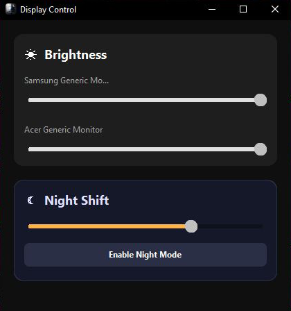

# Display Control

Display Control is a specialized Windows application for efficient monitor brightness management and integrated night mode control.

The project replaces cluttered Windows system settings with a clean, minimal, and functional interface focused on precision and performance.

---

## Features

Multi-Monitor Support  
Individual brightness control for each connected display.

Hardware Identification  
Reads real monitor model names via EDID using the Windows API instead of generic display labels.

Gamma-Based Night Mode  
High-efficiency blue light reduction using Gamma Ramp manipulation with smooth intensity control.

Optimized Interface  
Dark-optimized user interface built with CustomTkinter, designed for OLED displays and low-light environments.

Thread Management  
Optimized background processing prevents UI blocking during hardware communication.

---

## Installation

### Using the Prebuilt Executable

Download the latest .exe file from the Releases section.

Note: Since the application is not digitally signed, Windows SmartScreen may display a warning on first launch. The complete source code is available in this repository for transparency and verification.

---

### Running from Source

1. Clone the repository:

git clone https://github.com/southy404/display-control.git  
cd display-control

2. Install dependencies:

pip install -r requirements.txt

3. Start the application:

python display-control.py

---

## Build Configuration

To create a standalone executable using PyInstaller:

pyinstaller --noconfirm --onefile --windowed --name "Display Control" --icon "logo.ico" --add-data "logo.ico;." "display-control.py"

---

## System Requirements

Operating System: Windows 10 or Windows 11  
Hardware: Monitors supporting DDC/CI or Gamma Ramp control  
Python Version (for source execution): Python 3.10 or higher

---

## Architecture Overview

Display Control utilizes:

- Windows API (EDID access)
- Gamma Ramp manipulation for color temperature control
- screen-brightness-control for DDC/CI communication
- CustomTkinter for UI rendering
- Pillow for image handling

The application is designed for stability, low resource usage, and precise hardware interaction.

---

## License

MIT License

Copyright (c) 2026 southy404

Permission is hereby granted, free of charge, to any person obtaining a copy
of this software and associated documentation files (the "Software"), to deal
in the Software without restriction, including without limitation the rights
to use, copy, modify, merge, publish, distribute, sublicense, and/or sell
copies of the Software, and to permit persons to whom the Software is
furnished to do so, subject to the following conditions:

The above copyright notice and this permission notice shall be included in all
copies or substantial portions of the Software.

THE SOFTWARE IS PROVIDED "AS IS", WITHOUT WARRANTY OF ANY KIND, EXPRESS OR
IMPLIED, INCLUDING BUT NOT LIMITED TO THE WARRANTIES OF MERCHANTABILITY,
FITNESS FOR A PARTICULAR PURPOSE AND NONINFRINGEMENT. IN NO EVENT SHALL THE
AUTHORS OR COPYRIGHT HOLDERS BE LIABLE FOR ANY CLAIM, DAMAGES OR OTHER
LIABILITY, WHETHER IN AN ACTION OF CONTRACT, TORT OR OTHERWISE, ARISING FROM,
OUT OF OR IN CONNECTION WITH THE SOFTWARE OR THE USE OR OTHER DEALINGS IN THE
SOFTWARE.
